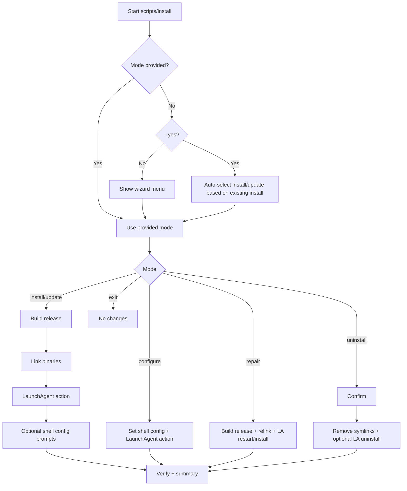
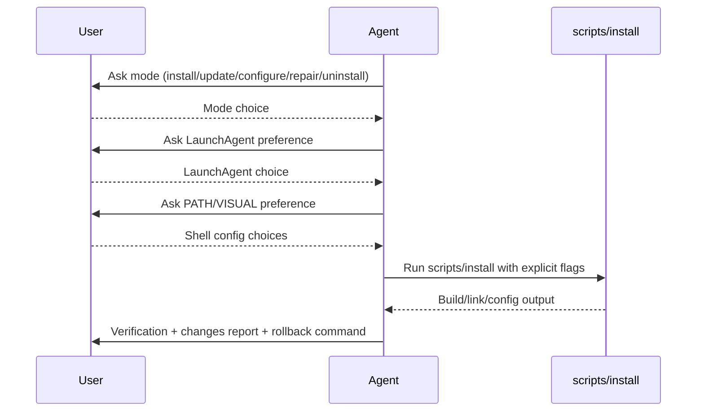

# TurboDraft Install Wizard Flow

This documents the full behavior of `scripts/install` so you can review and evolve it.

## High-level state flow

## Agent-guided interactive flow

## Detailed decision table

| Decision | Input | Behavior |
|---|---|---|
| Mode source | `--mode` present | Uses provided mode directly |
| Mode source | no `--mode`, `--yes` | Auto-chooses `install` or `update` based on existing install |
| Mode source | no `--mode`, interactive | Shows mode picker menu |
| Build step | install/update/repair | Runs `swift build -c release` |
| Symlink step | install/update/repair | Links `turbodraft`, `turbodraft-app`, `turbodraft-bench` |
| LaunchAgent | `--launch-agent auto` | Interactive ask (when needed) or restart if already installed |
| LaunchAgent | explicit action | Runs explicit install/restart/skip/uninstall path |
| Shell config | explicit `--set-path/--set-visual` | Applies requested yes/no choices |
| Shell config | interactive install/configure | Prompts user and applies chosen options |

## Post-run verification contract

1. `turbodraft --help`
2. `scripts/turbodraft-launch-agent status`
3. shell config review (`PATH`, `VISUAL`)
4. user-facing summary with rollback (`scripts/install --mode uninstall`)
